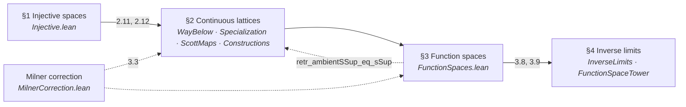
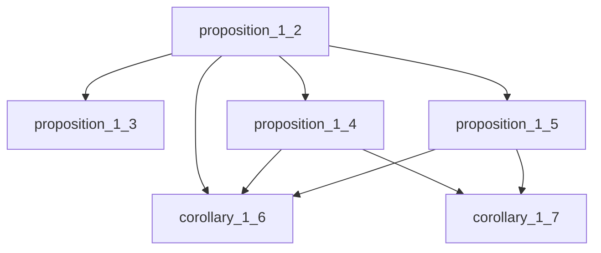
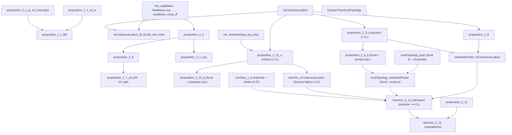
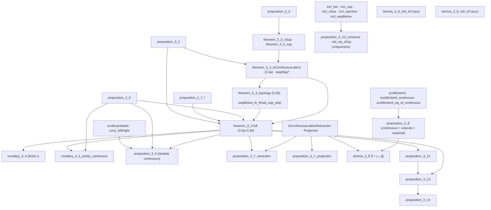
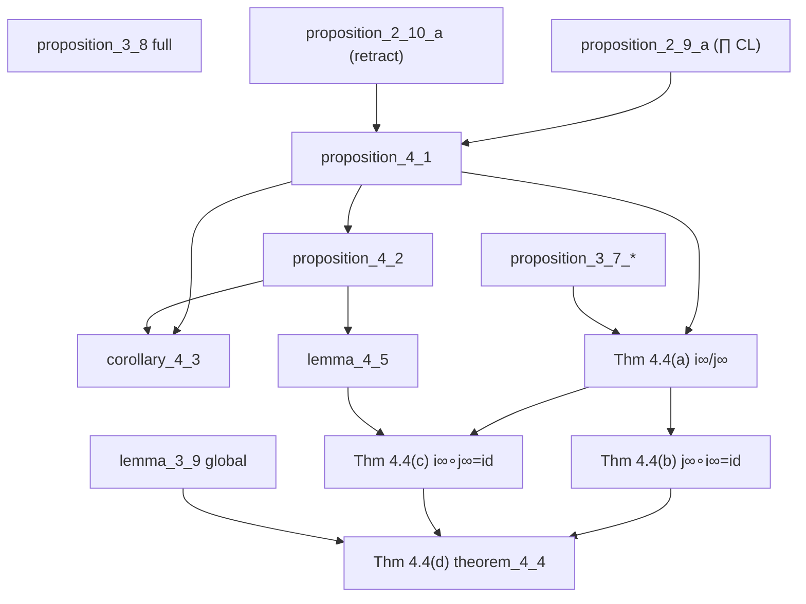

# A Lean 4 Formalization of Scott's *Continuous Lattices* (1972)

---

## Abstract

We present a complete machine-checked formalization of Dana Scott's landmark 1972 paper
*Continuous Lattices* (LNM 274), carried out in Lean 4 against mathlib and including the March
1972 Milner correction (pp. 135–136).

Scott's paper develops domain theory from a topological starting point. He defines *injective*
$T_0$-spaces—those with a strong extension property for continuous maps—and shows that they are
exactly the *continuous lattices*: complete lattices whose Scott topology is determined by the
order via the way-below relation ($\ll$). On this foundation he studies projections, retractions,
products, function spaces, and inverse limits. The capstone (Theorem 4.4) constructs an inverse
limit $D_\infty$ of function-space approximants and proves $D_\infty \cong [D_\infty \to D_\infty]$,
yielding a purely mathematical model for Church's untyped $\lambda$-calculus.

Our development formalizes **43 numbered results** from Scott's §1–§4 (Propositions, Corollaries,
Lemmas, and Theorems), each as a sorry-free Lean theorem, together with supporting infrastructure
(step functions, the `↟a` basis of Scott opens, Milner's coarser-than-Scott hypothesis, the
function-space tower, and the $i_\infty$/$j_\infty$ pair). The formalization is **classical**
(uses `Classical.choice` transitively) and follows Scott's proof dependency order. Where the Lean
proof required choices not visible in the original—or where dead ends were encountered—we record
detailed notes in §5. All proofs check with the standard footprint `[propext, Classical.choice,
Quot.sound]`.

---

## 1. Introduction

It is entirely fair to describe Scott's 1972 paper *Continuous Lattices* as his first fully detailed,
peer-reviewed publication of the famous $D_\infty$ model for the semantics of Church's untyped
$\lambda$-calculus—but with one crucial historical nuance: **the model was a complete accident**.
While the 1972 paper is the landmark account, Scott had been trying to prove that such a model was
mathematically *impossible*.

Three factors frame the breakthrough:

### The goal was types, not the untyped calculus

In the late 1960s Dana Scott worked alongside Christopher Strachey at Oxford. Scott was a firm skeptic
of Alonzo Church's untyped $\lambda$-calculus. He believed programming languages should be strictly
typed and famously argued that the untyped calculus lacked a legitimate mathematical foundation. He
began developing domain theory specifically to provide a denotational semantics for *typed* languages.

### The discovery of $D_\infty$ (1969)

To model the untyped $\lambda$-calculus, a space $D$ must be isomorphic to its own function space
($D \cong [D \to D]$). In standard set theory, Cantor's theorem makes this size-wise impossible: the
power of a function space strictly exceeds the size of the base set.

In November 1969, while attempting to formalize why this restriction made untyped models impossible,
Scott realized that if one restricts to Scott-continuous functions (those preserving directed
suprema) rather than all arbitrary functions, the space does not explode in size. By constructing an
inverse limit of algebraic lattices ($D_0 \to D_1 \to D_2 \to \cdots$), he built $D_\infty$, the
first non-degenerate, purely mathematical model of the untyped $\lambda$-calculus.

### Chronology of the papers

Although the definitive mathematical breakdown appeared in 1972, Scott's "first attempts" span a few
tightly knit manuscripts:

- **1969 (unpublished manuscript):** **[Sco69]** *Lattice-theoretic models for the $\lambda$-calculus*—the
  literal first write-up distributed among colleagues right after the November discovery.
- **1970 (conference paper):** **[Sco70]** *Outline of a mathematical theory of computation*—a brief, high-level
  introductory account.
- **1972 (published paper):** **[Sco72]** *Continuous Lattices*—prepared as a technical report in 1971; universally
  recognized as the landmark paper that formally gifted the mathematical and computer science
  communities the $D_\infty$ model.

When citing this work, it is standard practice to treat the 1972 paper as Scott's definitive
foundational model for Church's untyped calculus—remembering that he stumbled into it while trying to
prove the exact opposite.

Scott's paper itself opens by arguing that $T_0$-spaces, long treated as a mere exercise in separation
axioms, are natural once one cares about function spaces and extension properties rather than
geometry. That shift—from typed skepticism to the accidental $D_\infty$ model—is the backdrop for
the formalization in §3–§5.

The development documented below follows **[Sco72]** through the March 1972 Milner correction.
§2 summarizes Scott's original paper; §3–§4 describe the Lean development and catalog the
formalized theorems; §5 records proof notes where the mechanization adds detail beyond the
published text.

---

## 2. Scott's *Continuous Lattices*

**[Sco72]** develops domain theory from injective $T_0$-spaces. Scott's own abstract states the
arc of the paper: starting topologically, he introduces spaces with a strong extension property for
continuous maps; shows they are exactly the continuous lattices—complete lattices whose topology is
the Scott topology determined by the order; studies projections, subspaces, embeddings, products,
and function spaces; and proves the main result that one can embed every space in a continuous
lattice $D_\infty$ that is homeomorphic (and order-isomorphic) to its own function space
$[D_\infty \to D_\infty]$, yielding models for the Church–Curry $\lambda$-calculus.

Scott organizes the paper in four technical sections (following an introductory §0):

| Scott § | Title | Main content |
| --- | --- | --- |
| §1 | **Injective spaces** | Definition of injectivity; $\mathbb{O}$ and its powers; retract characterization (Cor. 1.6–1.7) |
| §2 | **Continuous lattices** | Way-below ($\ll$), Scott topology, Scott-continuous maps; products and retractions; injectivity ⟺ continuous lattice (Thm. 2.12) |
| §3 | **Function spaces** | $[D \to D']$ as a continuous lattice (Thm. 3.3); $\lambda$-abstraction, evaluation, projections, fixed points |
| §4 | **Inverse limits** | $D_\infty$ as inverse/direct limit; capstone $D_\infty \cong [D_\infty \to D_\infty]$ (Thm. 4.4) |

Our primary source text is the OCR transcription
[`sources/ScottContinLatt1972.md`](sources/ScottContinLatt1972.md) (from the LNM 274 PDF), checked
against [`sources/ScottContinLatt1972_vision.md`](sources/ScottContinLatt1972_vision.md) through the
Milner correction.

---

## 3. The Lean formalization

### 3.1 Scope and methodology

The Lean development lives under `Scott1972/ContinuousLattice/` (root import `Scott1972.lean`). We
track Scott's numbered statements: each row in §4 corresponds to a named theorem in the repository,
proved sorry-free. Results not separately numbered by Scott but required for later steps—such as
`wayBelow_interpolate`, `exists_wayBelow_subset`, and the Milner infrastructure—appear as supporting
lemmas in the module map below.

**Milner infrastructure** (March 1972 correction): `CoarserThanScottTopology`,
`scottOpen_of_coarserThanScott`, `scottLowerSubbasisSet`, `scottPrincipalUpSet` in
`MilnerCorrection.lean`.

**Notation:** `⊔S′` denotes the ambient join in $D′$ (`ambientSSup`); `⊔S` the subspace join;
`j(⊔S′) = ⊔S` is `retr_ambientSSup_eq_sSup`.

### 3.2 Constructivity

The formalization is **classical**. It uses mathlib topology, `Classical.choice` (transitively),
embedding into Sierpiński powers, and order-theoretic arguments that have not been audited for
constructivity. Every completed proof reports `#print axioms` as
`[propext, Classical.choice, Quot.sound]`.

### 3.3 Module map

| Scott § | Title | Lean modules |
| --- | --- | --- |
| §1 | **Injective spaces** | `Injective.lean` |
| §2 | **Continuous lattices** | `WayBelow.lean`, `Specialization.lean`, `ScottMaps.lean`, `Constructions.lean`, `MilnerCorrection.lean` |
| §3 | **Function spaces** | `FunctionSpaces.lean` |
| §4 | **Inverse limits** | `InverseLimits.lean`, `FunctionSpaceTower.lean` |

---

## 4. Catalog of formalized results

We formalize **43** numbered results from Scott §1–§4. Each entry is a full statement matching
Scott's numbering, proved without `sorry`. Theorem 4.4 is split into four subgoals **(a)–(d)** in
both Scott and Lean.

**Supporting keystones** (not separately numbered by Scott): `directedOn_wayBelow`,
`wayBelow_interpolate` (interpolation for $\ll$, **axiom-free**), and `exists_wayBelow_subset`
(the $\uparrow a$ basis of the Scott topology) in `WayBelow.lean`; these underpin Proposition 2.11.

| § | Scott | Lean identifier(s) | Module |
| --- | --- | --- | --- |
| 1 | Prop 1.2 | `proposition_1_2` | `Injective.lean` |
| 1 | Prop 1.3 | `proposition_1_3` | `Injective.lean` |
| 1 | Prop 1.4 | `proposition_1_4` | `Injective.lean` |
| 1 | Prop 1.5 | `proposition_1_5` | `Injective.lean` |
| 1 | Cor 1.6 | `corollary_1_6` | `Injective.lean` |
| 1 | Cor 1.7 | `corollary_1_7` | `Injective.lean` |
| 2 | Prop 2.1 | `proposition_2_1` | `Specialization.lean` |
| 2 | Prop 2.2 | `bot_wayBelow`, `WayBelow.sup`, `WayBelow.trans_le`, `WayBelow.le_trans`, `wayBelow_self_iff_scottOpen_Ici`, `wayBelow_sSup_iff` | `WayBelow.lean` |
| 2 | Prop 2.4 | `isContinuousLattice_iff_isLUB_sInf_nhds` | `WayBelow.lean` |
| 2 | Prop 2.5 | `proposition_2_5` | `ScottMaps.lean` |
| 2 | Prop 2.6 | `proposition_2_6` | `ScottMaps.lean` |
| 2 | Prop 2.8 | `proposition_2_8` | `Constructions.lean` |
| 2 | Prop 2.9(a) | `proposition_2_9_a` | `Constructions.lean` |
| 2 | Prop 2.9(b) | `proposition_2_9_b`, `proposition_2_9` | `Constructions.lean` |
| 2 | Prop 2.10(a) | `proposition_2_10_a` | `FunctionSpaces.lean` |
| 2 | Prop 2.10(b) | `proposition_2_10_b`, `proposition_2_10` | `FunctionSpaces.lean` |
| 2 | Prop 2.11 | `proposition_2_11` | `Constructions.lean` |
| 2 | Thm 2.12 | `theorem_2_12`, `theorem_2_12_backward`, `theorem_2_12_forward` | `Theorem212.lean` |
| 3 | Prop 3.2 | `proposition_3_2` | `FunctionSpaces.lean` |
| 3 | Thm 3.3(a) | `theorem_3_3_isContinuousLattice`, `ScottMap.instCompleteLattice`, `stepMap`, `stepMap_wayBelow`, `stepMap_pointwise_sSup` | `FunctionSpaces.lean` |
| 3 | Thm 3.3(b) | `theorem_3_3_topology`, `theorem_3_3`, `wayBelow_le_finset_sup_step`, `pointwiseSubbasic_scottOpen` | `FunctionSpaces.lean` |
| 3 | Cor 3.4 | `corollary_3_4_jointly_continuous`, `corollary_3_4_preservesDirectedSup`, `corollary_3_4` | `FunctionSpaces.lean` |
| 3 | Prop 3.5 | `proposition_3_5`, `scottLambda`, `curry_left/right_preservesDirectedSup`, `lambda_outer_preservesDirectedSup` | `FunctionSpaces.lean` |
| 3 | Prop 3.7 | `proposition_3_7_retraction`, `proposition_3_7_projection` | `FunctionSpaces.lean` |
| 3 | Prop 3.8 | `proposition_3_8`, `scottExtend_maximal`, `continuous_eq_sSup_openInfs` | `Constructions.lean` |
| 3 | Lemma 3.9 | `lemma_3_9`, `scottExtend_maximal_le` | `Theorem212.lean` |
| 3 | Prop 3.10 | `incl_sSup`, `incl_injective`, `incl_wayBelow`, `proposition_3_10_converse`, `retr_eq_sSup` | `FunctionSpaces.lean` |
| 3 | Prop 3.12 | `proposition_3_12`, `IsProjection`, `isProjection_sSup`, `Projections.instCompleteLattice` | `FunctionSpaces.lean` |
| 3 | Prop 3.13 | `proposition_3_13`, `Proposition313.projection` | `FunctionSpaces.lean` |
| 3 | Prop 3.14 | `proposition_3_14`, `Proposition314.fixMap`, `fix_eq`, `fix_le`, `fix_unique` | `FunctionSpaces.lean` |
| 4 | Prop 4.1 | `proposition_4_1`, `InverseLimit`, `inverseLimitRetraction` | `InverseLimits.lean` |
| 4 | Prop 4.2 | `proposition_4_2`, `embInf`, `projInf`, `iComp`, `embInf_succ`, `inverseLimit_eq_iSup` | `InverseLimits.lean` |
| 4 | Cor 4.3 | `corollary_4_3`, `coconeInf`, `coconeInf_comp_embInf` | `InverseLimits.lean` |
| 4 | Lemma 4.5 | `lemma_4_5`, `idInf_eq_iSup` | `InverseLimits.lean` |
| 4 | Thm 4.4(a) | `embInfInf`, `projInfInf`, `iInfTerm`, `jInfTerm`, `*_apply`, `*_preservesDirectedSup` | `FunctionSpaceTower.lean` |
| 4 | Thm 4.4(b) | `projInfInf_comp_embInfInf` | `FunctionSpaceTower.lean` |
| 4 | Thm 4.4(c) | `embInfInf_comp_projInfInf` | `FunctionSpaceTower.lean` |
| 4 | Thm 4.4(d) | `theorem_4_4`, `theorem_4_4_orderIso` | `FunctionSpaceTower.lean` |

### 4.1 Proof dependency structure

Scott §1–§4 are not independent modules; the Lean import graph follows Scott's exposition order.



### 4.2 §1 Injective spaces — result hierarchy

The six results of §1 form a short chain from the Sierpiński space $\mathbb{O}$ to the retract
characterization of injectivity.




### 4.3 §2 Continuous lattices — result hierarchy




### 4.4 §3 Function spaces — result hierarchy




### 4.5 §4 Inverse limits — result hierarchy

Scott §4 is complete in Lean: Propositions 4.1–4.2, Corollary 4.3, Lemma 4.5, and Theorem 4.4
**(a)–(d)**. See §5.3 for proof notes on the capstone.




---

## 5. Notes on the formalization

This section records proof strategy, Lean engineering choices, and lessons learned where the
mechanization goes beyond Scott's published text. Results in §1 follow Scott's short arguments
directly and are not discussed here. Proposition 2.1 is split in Lean as `proposition_2_1_of_le` and
`proposition_2_1_le_of_converges`, then bundled as `proposition_2_1`.

### 5.1 Continuous lattices (Scott §2)

Section §2 is where most of the order-topology alignment work lives: products (2.9), retractions
(2.10), injectivity (2.11), and the equivalence theorem (2.12) all required careful handling of
Scott topologies without registering competing instances.

#### Proposition 2.6 (joint ↔ separate continuity) — `proposition_2_6`

Scott states that a function of several variables between complete lattices is continuous jointly
if and only if it is continuous in each variable separately. We formalize the two-variable case
`f : D × D' → D''`, with continuity phrased as `PreservesDirectedSup` (justified by Prop 2.5),
and the product `D × D'` carrying the componentwise complete-lattice structure (whose induced
topology is the product topology). The proof follows Scott's directed-net argument:

- **Joint ⟹ separate.** Precompose `f` with the slice map `x ↦ (x, y)`. The image of a directed
  `S ⊆ D` under this map is directed in `D × D'` with least upper bound `(⊔S, y)` (computed
  componentwise via `Prod.fst_sSup` / `Prod.snd_sSup`, using `S` nonempty for the constant second
  coordinate). Joint preservation of that supremum therefore yields preservation in the first
  variable; the second variable is symmetric.
- **Separate ⟹ joint** (the substance). For directed `S* ⊆ D × D'`, project to the directed sets
  `S = fst '' S*` and `S' = snd '' S*` (directedness via `DirectedOn.fst` / `DirectedOn.snd`), so
  that `⊔S* = (⊔S, ⊔S')`. Then:
  - `⊔(f '' S*) ≤ f(⊔S*)` is immediate from monotonicity of `f` (assembled from the separate
    monotonicities `hmono1`, `hmono2`).
  - `f(⊔S*) ≤ ⊔(f '' S*)`: unfolding separate continuity twice gives
    `f(⊔S*) = ⊔_{x∈S} ⊔_{y∈S'} f(x, y)`; for each pair `x ∈ S`, `y ∈ S'` there exist witnesses
    `(x, b), (a, y) ∈ S*`, and **directedness of `S*`** supplies `r ∈ S*` above both, so
    `(x, y) ≤ r` and `f(x, y) ≤ f(r) ≤ ⊔(f '' S*)` by monotonicity. This is exactly Scott's
    "monotonicity + directedness" step.

Sorry-free; `#print axioms` gives `[propext, Classical.choice, Quot.sound]` (the standard
classical footprint throughout this development).

#### Proposition 2.8 (finite lattices are continuous) — `proposition_2_8`

Scott states this as a one-line example. The Lean proof isolates the genuinely finite step in a
reusable lemma `directedOn_finite_sSup_mem`: *a non-empty finite directed set attains its
supremum* (`⊔S ∈ S`). A maximal element `m ∈ S` exists by `Set.Finite.exists_maximal`; by
directedness any `s ∈ S` and `m` have an upper bound `c ∈ S`, and maximality forces `c ≤ m`, so
`s ≤ m`. Hence `m` is the greatest element, `IsLUB S m`, and `⊔S = m ∈ S`. With this, every
principal up-set `Set.Ici y` is Scott-open (a directed `S` with `y ≤ ⊔S` has `⊔S ∈ S`), so
`y ≪ y` via `wayBelow_self_iff_scottOpen_Ici`, and `y` is trivially the supremum of
`{x | x ≪ y}`. `[Finite D]` suffices (subsets are finite via `Set.toFinite`).

#### Proposition 2.9 (products of continuous lattices) — `proposition_2_9_a`, `proposition_2_9_b`

Scott's Proposition 2.9 is a **conjunction** of an order-theoretic and a topological claim, so we
split it: `proposition_2_9_a` (the product is a continuous lattice), `proposition_2_9_b` (the Scott
topology of the product equals the product of the Scott topologies), and the bundled
`proposition_2_9 := ⟨a, b⟩`.

**2.9(a) — order content (`proposition_2_9_a`).** A product `∀ i, Eᵢ` of continuous lattices is a
continuous lattice. The construction is the cylinder element: for `a ≪ yᵢ` in factor `Eᵢ`, let
`[a]ⁱ := Function.update ⊥ i a`. Then `[a]ⁱ ≪ y` in the product, witnessed by the preimage
`{z | zᵢ ∈ U}` of a Scott-open `U ⊆ Eᵢ` with `yᵢ ∈ U ⊆ Ici a`: this set is an upper set, and
inaccessible because suprema are coordinatewise (`sSup_apply_eq_sSup_image`), so a directed `S`
with `(⊔S)ᵢ ∈ U` already has some `f ∈ S` with `fᵢ ∈ U`. Given any upper bound `b` of
`{x | x ≪ y}`, each `[a]ⁱ ≤ b` gives `a = ([a]ⁱ)ᵢ ≤ bᵢ`; ranging over `a ≪ yᵢ` and using
continuity of `Eᵢ` (`(hE i).sSup_wayBelow`) yields `yᵢ ≤ bᵢ` for all `i`, i.e. `y ≤ b`.

**2.9(b) — topology agreement (`proposition_2_9_b`).** We prove the *full equality* of topologies
`scottTopologicalSpace = Pi.topologicalSpace (fun _ => scottTopologicalSpace)` by `le_antisymm`;
no Milner-style coarseness hypothesis is needed. Working with explicit topology terms (`Eᵢ` carries
no `TopologicalSpace` instance) keeps us clear of the `specializationPreorder` diamond, and the
mathlib order `t₁ ≤ t₂` unfolds *definitionally* to `∀ U, IsOpen[t₂] U → IsOpen[t₁] U`.
  - **Product ⊆ Scott** (`scott ≤ ⨅ᵢ induced (eval i)`): each projection preserves directed
    suprema (`sSup_apply_eq_sSup_image`), hence is Scott-continuous
    (`continuous_of_preservesDirectedSup`); `le_iInf` + `continuous_iff_le_induced` finish.
  - **Scott ⊆ Product**: for a Scott-open `U ∋ z` the `↟a` basis (`exists_wayBelow_Ici_subset`,
    the `Ici`-strengthening of `exists_wayBelow_subset`) gives `a ≪ z` with `↑a ⊆ U`. Three new
    structural lemmas about way-below in a product do the rest: `wayBelow_proj`
    (`a ≪ z ⟹ aᵢ ≪ zᵢ`, via the preimage under `v ↦ Function.update z i v`, Scott-open by
    `update_preservesDirectedSup`) and `wayBelow_finite_support` (`a ≪ z` has finite support: the
    truncations `Z F = (if · ∈ F then z· else ⊥)` are directed with sup `z`, so `a ≤ Z F` for some
    finite `F`). The finite box `⋂_{i∈F} eval i ⁻¹' Vᵢ` (with `Vᵢ ∋ zᵢ` Scott-open inside `Ici aᵢ`)
    is product-open (`isOpen_biInter_finset` of induced-opens, each `≥` the product topology by
    `iInf_le`) and lies in `↑a ⊆ U` (off `F`, `aⱼ = ⊥ ≤ wⱼ`; on `F`, `aᵢ ≤ wᵢ`).

`classical` supplies the `DecidableEq` for `Function.update`; footprint
`[propext, Classical.choice, Quot.sound]` for all of 2.9(a)/(b).

**Engineering notes / lessons from 2.9(b).** This was the hardest single proof in the development;
recording the dead-ends so the next session does not re-pay the cost):

- *Avoid `letI` for the factor/product topologies.* The tempting move is
  `letI : ∀ i, TopologicalSpace (Eᵢ) := fun _ => scottTopologicalSpace` so that mathlib's
  `Pi.topologicalSpace`, `continuous_apply`, `isOpen_biInter_finset`, … resolve by instance. But our
  imports make `specializationPreorder` an active instance, so a `TopologicalSpace (Eᵢ)` in scope
  introduces a **second `Preorder (Eᵢ)`** that fights the `CompleteLattice` one — the same diamond
  that broke `scottExtend_eq_of_continuous` earlier. Keeping every topology an **explicit term**
  (`@Pi.topologicalSpace …`, `@IsOpen _ scottTopologicalSpace …`) and never registering an instance
  is what makes the proof go through. The order reasoning (way-below, `sSup`, finite support) lives
  in *instance-free* lemmas (`wayBelow_proj`, `wayBelow_finite_support`) precisely so they never see
  a competing topology.
- *Use the definitional unfolding of the topology order.* `TopologicalSpace.le_def` shows
  `t₁ ≤ t₂` **is** `∀ U, IsOpen[t₂] U → IsOpen[t₁] U` (the partial order's `le` field), so `intro U hU`
  works directly on a `P ≤ S` goal and `iInf_le _ i _ hopen` turns an induced-open into a
  product-open with no `le_def` rewrite or `IsOpen.mono` lemma. This is the single most useful fact
  for product/Scott topology bridges.
- *Prefer `Set.Ici a ⊆ U` over `↟a ⊆ U`.* `exists_wayBelow_subset` actually proves the stronger
  `Set.Ici a ⊆ U` (the witness `a` lies in the upper-set `U`), so the new `exists_wayBelow_Ici_subset`
  lets the box-containment step ask only for `a ≤ w` instead of `a ≪ w`. This **eliminates the
  way-below `⟸` characterization** (componentwise-`≪` + finite-support ⟹ product-`≪`) entirely —
  a large, fiddly `Finset.sup`-of-cylinders argument we would otherwise have needed.
- *Finite support falls out of the truncations, not a separate axiom.* `a ≪ z` plus the directed
  family `Z F = (if · ∈ F then z· else ⊥)` (sup `z`) gives `a ≤ Z F` for some finite `F` via
  `wayBelow_sSup_iff`; then `aⱼ ≤ (Z F)ⱼ = ⊥` off `F`. No independent "way-below ⟹ finite support"
  theorem is required.
- *`@`-argument order is worth checking empirically.* `isOpen_biInter_finset` autobinds as
  `@isOpen_biInter_finset X α [inst] s f h` (space first, index second); `isOpen_induced_iff` needs
  the codomain topology, supplied painlessly by the named argument `(t := scottTopologicalSpace)`
  rather than a positional `@`. When in doubt, feed one wrong argument and read the "expected type"
  in the error to recover the true order.
- *Beta-reduce before `rw`.* `PreservesDirectedSup f` unfolds to `f (sSup T) = …` with `f` a literal
  lambda, so the goal is `(fun v => update z i v) (sSup T) j`; a `Function.update_self` rewrite only
  matches after a `show` (or `dsimp only`) forces the beta reduction to `Function.update z i (sSup T)`.

#### Proposition 2.10 (a retract of a CL is a CL) — `proposition_2_10_a`, `proposition_2_10_b`

Like 2.9, Scott's 2.10 bundles an order claim and a topology claim; we split it as
`proposition_2_10_a` / `proposition_2_10_b` with the bundled `proposition_2_10`. A *retract* is the
existing `IsContinuousLatticeRetraction D D'`: Scott maps `i : D → D'`, `j : D' → D` with
`j ∘ i = id`. We take `D'` continuous and conclude both halves for `D`.

The single engine is `retr_wayBelow_of_wayBelow_incl`: **`x' ≪ i(d)` in `D'` ⟹ `j(x') ≪ d` in
`D`**. Witness the `D`-way-below by `i⁻¹V'` for an ambient Scott-open witness `V'` of `x' ≪ i(d)`
(`i⁻¹V'` is Scott-open since `i` preserves directed sups, `scottOpen_preimage`); for `z ∈ i⁻¹V'`,
`x' ⊑ i(z)` gives `j(x') ⊑ j(i(z)) = z`. With `sSup_image_retr_wayBelow`
(`d = ⊔_D {j(x') : x' ≪ i(d)}`, from `j(⊔'S′) = ⊔S` + continuity of `D'`):
  - **2.10(a).** Any upper bound `b` of `{x | x ≪ d}` dominates every `j(x')`, hence the supremum
    `d`. (`IsLUB` is immediate.)
  - **2.10(b).** `scott = induced i scott'`. The easy `scott ≤ induced` is `scottOpen_preimage`
    again. The hard `induced ≤ scott` (Milner) shows the family `{i⁻¹(↟x') : x' ∈ D'}` is a
    **basis** of `D`'s Scott topology: given Scott-open `U ∋ d`, the directed family
    `{j(x') : x' ≪ i(d)}` (sup `d`) meets `U` at some `j(x')`, and `i⁻¹(↟x') ⊆ U` because
    `x' ≪ i(z) ⟹ j(x') ⊑ z` and `U` is upper. Each `i⁻¹(↟x')` is induced-open by construction, so
    every Scott-open is a union of induced-opens, i.e. induced-open.

**Engineering notes / lessons from 2.10:**

- *No projection, no Milner hypothesis needed.* Scott proves 2.10 for general retractions and only
  needs *projections* later (for the function-space 3.7/3.9). The whole proof goes through with the
  bare `IsContinuousLatticeRetraction` (Scott maps + `j ∘ i = id`); `incl_retr_le` is never used.
  And, as with 2.9(b), the topology agreement is a genuine equality — `CoarserThanScottTopology`
  does not appear. The Milner subtlety ("lubs in the subspace are *larger*, so a relativised open
  need not be lattice-open") is dissolved by the retraction: `j(⊔S′) = ⊔S` realigns the inequality.
- *Reuse the abstract structure instead of building a `CompleteLattice` on a subtype.* The tempting
  faithful reading — fixed points `{x // j x = x}` of an idempotent Scott map, with transported
  joins `sSup_K S = j(⊔' i''S)` — forces a hand-built `CompleteLattice` instance (every axiom, then
  continuity, then topology) and is several hundred lines. Phrasing the retract as *its own* lattice
  `D` with Scott maps to/from `D'` captures exactly the same content (`i` preserving directed sups
  **is** the statement that `D`-joins are `j` of ambient joins) at a fraction of the cost.
- *`isOpen_induced_iff` needs the codomain topology pinned.* `Eᵢ`/`D'` carry no `TopologicalSpace`
  instance, so `rw [isOpen_induced_iff]` fails instance synthesis; supply `(t := scottTopologicalSpace)`
  (same trick as 2.9(b)).
- *`scottOpen_preimage` is the workhorse.* "Preimage of a Scott-open under a Scott map is Scott-open"
  appears three times here (the way-below witness, and both topology inclusions). Packaging
  `incl_preservesDirectedSup : PreservesDirectedSup ⇑i` once keeps the call sites clean.

This unblocks the **backward half of Theorem 2.12** (injective ⟹ CL) at the *retract* level; the
embedding of an injective space into a power of `𝕆` (1.6) supplies the rest, and 2.12 is now
**complete** (see the Theorem 2.12 note below).

#### Keystones for 2.11: interpolation and the `↟a` basis — `WayBelow.lean`

Two standard facts about `≪` that mathlib does not provide and that the capstone needs:

- **Interpolation** (`wayBelow_interpolate`): in a continuous lattice `a ≪ c ⟹ ∃ b, a ≪ b ≪ c`.
  The set `M = {m | ∃ x, m ≪ x ∧ x ≪ c}` is directed (apply directedness of `{· ≪ x}` twice)
  with `⊔M = c` (continuity twice); then `a ≪ c = ⊔M` forces `a ≪ m ≤ x ≪ c` for some
  `m ≪ x ≪ c`, so `b := x`. Notably this is **axiom-free** (`#print axioms` reports none).
- **`↟a` basis** (`exists_wayBelow_subset`): every Scott-open `U ∋ z` contains a basic
  neighbourhood `↟a = {w | a ≪ w}` with `a ≪ z`. Since `z = ⊔{a | a ≪ z}` is a directed sup in
  the open `U`, inaccessibility yields `a ≪ z` with `a ∈ U`, and `↟a ⊆ ↑a ⊆ U`.

#### Proposition 2.11 (continuous lattices are injective) — `proposition_2_11`

The substantial half of Theorem 2.12. The witness is an explicit operator
`scottExtend e f y = ⊔ { ⊓ f''(e⁻¹V) : V an open nbhd of y }` (a standalone `def`, purely
order-theoretic). Two lemmas about it:

- **Extends `f`** (`scottExtend_eq_of_continuous`). The `≤` bound is immediate (`f x₀` is one of
  the values met). For `≥`, continuity of the lattice is essential: for each `a ≪ f x₀`, the
  Scott-open `↟a` pulls back along the continuous `f`, and the **embedding** turns that into an
  open `V ⊆ Y` with `e⁻¹V = f⁻¹(↟a)`; on `e⁻¹V`, `f ≥ a`, so `a ≤ ⊓ f''(e⁻¹V) ≤ g(e x₀)`. Summing
  over `a ≪ f x₀` (continuity) gives `f x₀ ≤ g(e x₀)`.
- **Continuous** (`scottExtend_continuous`). Uses the `↟a` basis: for Scott-open `U` and `g y₀ ∈ U`
  pick `a ≪ g y₀` with `↟a ⊆ U`; as `g y₀` is a directed sup, `a ≪ ⊓ f''(e⁻¹V)` for some open
  `V ∋ y₀`, and that value is `≤ g y'` for all `y' ∈ V`, so `V ⊆ g⁻¹U`.

A Lean-specific wrinkle: `E` carries no global `TopologicalSpace` instance (its topology is
`scottTopologicalSpace`), so lemmas like `IsOpen.preimage` that *synthesize* `[TopologicalSpace E]`
fail. The order-heavy `scottExtend_eq_of_continuous` uses `continuous_def` (whose topology
arguments are ordinary implicits, unified from the hypothesis) to avoid both the synthesis failure
and the specialization-order diamond a `letI` would introduce; the purely topological
`scottExtend_continuous` and `proposition_2_11` use `letI : TopologicalSpace E := scottTopologicalSpace`.
Footprint `[propext, Classical.choice, Quot.sound]`.

#### Theorem 2.12 (injective ⟺ continuous lattice) — `theorem_2_12`, `theorem_2_12_backward` (`Theorem212.lean`)

Both directions are now closed; `theorem_2_12` is the full biconditional:

> A `T₀`-space is injective **iff** it is homeomorphic to a continuous lattice under its Scott topology.

- **Forward** (CL ⟹ injective) is `theorem_2_12_forward` (= 2.11).
- **Backward** (injective ⟹ CL) is `theorem_2_12_backward`. The argument:
  1. By Corollary 1.6, an injective `T₀`-space `D` is a *retract* of a Sierpiński power
     `L = ι → 𝕆` (`𝕆 = Prop`): there are continuous `s : D → L`, `r : L → D` with `r ∘ s = id`.
  2. `L` is a continuous lattice (`sierpinskiPower_isContinuousLattice`, from 2.8 + 2.9a) whose
     Scott topology *is* its product topology (`scottTopology_sierpinskiPower`, from 2.9b plus
     `scottTopology_prop`: the Scott topology on `𝕆` is the Sierpiński topology).
  3. `e := s ∘ r` is therefore a **Scott-continuous idempotent** on `L`. Its fixed-point set
     `IdemFix e` carries the ambient-supremum-corrected complete-lattice structure
     (`IdemFix.completeLattice`), is a continuous lattice by Proposition 2.10
     (`idemFix_isContinuousLattice`), and `d ↦ s d` is a homeomorphism `D ≃ₜ IdemFix e`.

**Engineering notes / lessons from 2.12:**

- *Fixed points of a monotone idempotent are a complete lattice* for free via `completeLatticeOfSup`:
  take `sSup_K S = e (sSup_L (val '' S))` and `sInf` derived. No closure/kernel (`e ≤ id` or
  `e ≥ id`) hypothesis is needed — only monotone + idempotent — and Scott-continuity of `e` is what
  makes the inclusion/corestriction `ScottMap`s, so the retract machinery of 2.10 applies verbatim.
- *The subtype-topology trap.* `IdemFix e = {x : L // e x = x}` is reducibly a subtype of `L`, so it
  **auto-inherits the subspace `TopologicalSpace`**, which competes with the Scott topology coming
  from its (non-instance) `CompleteLattice`. This breaks `Continuous.comp`/`subtype_mk` (they
  synthesize the *subspace* instance, not Scott). The fix: build the homeomorphism against the
  canonical subspace topology (where those lemmas work), then transport across the propositional
  equality `scott = subspace` — itself `idemFix_scottTopology` (= `induced val scott_L`) composed
  with `scottTopology_sierpinskiPower` (`scott_L = product`), closing by `rfl`.
- *Statement shape.* Endowing an abstract injective space with a lattice is impossible literally, so
  the faithful statement is "homeomorphic to a continuous lattice under its Scott topology"; the
  reverse arrow transfers injectivity across the homeomorphism via `IsInjectiveSpace.of_retract`.
- Footprint `[propext, Classical.choice, Quot.sound]`.

### 5.2 Function spaces (Scott §3)

Section §3 builds the function-space lattice, proves agreement with pointwise convergence (Theorem
3.3), and develops the projection and fixed-point infrastructure needed for §4.

#### Theorem 3.3(a) (`[D → D']` is a continuous lattice) — `theorem_3_3_isContinuousLattice` (`FunctionSpaces.lean`)

Scott's "pointwise" argument, in three movements.

1. **Complete lattice on `[D → D']`.** `ScottMap D D'` is a genuine `def` (a subtype of
   `D → D'`), so — unlike the `IdemFix` subtype trap of 2.12 — it carries *no* auto-synthesized
   order/topology to fight. We register `instPartialOrder` (pointwise `≤`), `instSupSet`
   (`sSupMaps F x = ⊔{g x | g ∈ F}`, which is itself a `ScottMap` because pointwise suprema of
   Scott maps preserve directed sups), prove `isLUB_sSup`, and close with
   `completeLatticeOfSup`. Crucially `sSup` here is *pointwise* (`sSup_apply` is `rfl`), matching
   Scott's observation that **arbitrary** (not just directed) joins are computed pointwise — while
   infima are *not* (derived as `⊔` of lower bounds by `completeLatticeOfSup`).
2. **Step functions.** `ē[e,e'](x) = e'` if `e ≪ x` else `⊥`, encoded as `⨆ _ : e ≪ x, e'`
   (`stepFun`) to dodge any `Decidable (e ≪ x)`. Scott-continuity of `stepFun` is exactly the
   Scott-openness of the way-above set `{x | e ≪ x}` (`scottOpen_wayBelow`, true in *any* complete
   lattice): inaccessibility of that open set supplies the member of a directed `S` realizing the
   value.
3. **Way-below + reconstruction.** `e' ≪ f e ⟹ ē[e,e'] ≪ f`, witnessed by the Scott-open
   `{g | e' ≪ g e}` (open because joins are pointwise, so inaccessibility reduces to
   `wayBelow_sSup_iff` in `D'`); this is the **topological** way-below of `WayBelow.lean`, so we
   never need an order-theoretic ≪-characterization. And `f x = ⊔{e' | ∃ e ≪ x, e' ≪ f e}`
   (`stepMap_pointwise_sSup`) follows from `x = ⊔{e ≪ x}` (continuity of `D`), `f` preserving that
   directed sup, and `f x = ⊔{w ≪ f x}` (continuity of `D'`) + `wayBelow_sSup_iff`. Continuity of
   `[D → D']` then drops out: any upper bound `g` of `{h ≪ f}` dominates every `ē[e,e'] ≪ f`, hence
   pointwise `e' ≤ g x`, hence `f x = ⊔{…} ≤ g x`.

**Engineering notes / lessons from 3.3(a):**

- *Register the lattice as a real instance.* Because `ScottMap` is a plain `def`, a global
  `CompleteLattice` instance is safe and makes `≪`, `ScottOpen`, and `IsContinuousLattice`
  typecheck on the function space with no `@`/`letI` gymnastics — the opposite experience to the
  `IdemFix` subtype.
- *`⨆ _ : p, a` is the clean "indicator".* It is `a` when `p` holds (`iSup_pos`) and `⊥` otherwise
  (`iSup_neg`), needs no `Decidable`, and commutes with the proofs cleanly.
- *Topological ≪ is an asset, not a burden here.* Proving `ē[e,e'] ≪ f` by exhibiting one
  Scott-open set is shorter than any directed-set argument; the lattice's pointwise `sSup` makes its
  inaccessibility immediate.
- Footprint `[propext, Classical.choice, Quot.sound]`.

#### Theorem 3.3(b) (lattice topology = pointwise-convergence topology) — `theorem_3_3_topology` (`FunctionSpaces.lean`)

The function space carries two topologies: the Scott topology of the continuous lattice
`[D → D']` (from `ScottMap.instCompleteLattice`) and the product/pointwise-convergence topology
`scottMapPointwiseTopology` generated by `{f | f x ∈ U}` (`U` Scott-open in `D'`). They are equal.

- **pointwise ⊆ Scott** (`le_generateFrom_iff_subset_isOpen`): each subbasic `{f | f x ∈ U}` is
  Scott-open in the lattice (`pointwiseSubbasic_scottOpen`). Inaccessibility is immediate because
  the lattice's `sSup` is *pointwise* (`ScottMap.sSup_apply`), reducing to inaccessibility of `U`
  in `D'`. (This is the half Scott notes is automatic on p. 136: lubs are pointwise, so **no Milner
  hypothesis is needed** — unlike 2.9–2.10.)
- **Scott ⊆ pointwise** is the substance, via the `↟φ`-basis of a continuous lattice
  (`exists_wayBelow_subset`, using 3.3(a)): given a Scott-open `U ∋ g`, pick `φ ≪ g` with
  `↟φ ⊆ U`. The key lemma `wayBelow_le_finset_sup_step` then shows `φ ≪ g` forces
  `φ ≤ ⊔ᵢ ē[eᵢ,eᵢ']` for **finitely many** pairs with `eᵢ' ≪ g eᵢ`: the finite joins of step
  functions below `g` form a *directed* family (`Finset.sup` over `F₁ ∪ F₂`) with supremum `g`
  (pointwise reconstruction again), so `wayBelow_sSup_iff` lands `φ` below one of them. The finite
  intersection `W = ⋂ᵢ {h | eᵢ' ≪ h eᵢ}` is then a pointwise-open (`isOpen_biInter_finset`)
  neighbourhood of `g` with `W ⊆ ↟φ ⊆ U`: any `h ∈ W` has every `ē[eᵢ,eᵢ'] ≪ h`
  (`stepMap_wayBelow`), hence `⊔ᵢ ē[eᵢ,eᵢ'] ≪ h` (`wayBelow_finset_sup`) and `φ ≪ h`.

**Engineering notes / lessons from 3.3(b):**

- *Finiteness enters exactly once.* The only place finiteness of the step-function decomposition is
  needed is to keep `W` a *finite* intersection (hence open). It is delivered by realizing `g` as a
  directed sup of `Finset.sup`s of step functions and invoking `wayBelow_sSup_iff` — the standard
  "compact basis" move, here done concretely with `Finset (D × D')`.
- *No ambient instance on `ScottMap`.* Since the two topologies are competing non-instances, the
  proof passes them explicitly (`@isOpen_iff_forall_mem_open`, `@isOpen_biInter_finset`); this is
  painless precisely because `ScottMap` carries no auto-synthesized `TopologicalSpace`.
- *Beware ascription into `sSup`.* `(sSup Sg : D → D')` makes Lean elaborate `sSup` at type
  `D → D'` (wrong `SupSet`); write `((sSup Sg : ScottMap D D') : D → D')` to keep the lattice join.
- This closes **3.3 in full** (`theorem_3_3`), with no Milner hypothesis, contrary to the earlier
  expectation recorded for 2.9–2.10.
- Footprint `[propext, Classical.choice, Quot.sound]`.

#### Corollary 3.4 (joint continuity of evaluation) — `corollary_3_4_jointly_continuous` (`FunctionSpaces.lean`)

`eval : [D → D'] × D → D'`, `(f, x) ↦ f x`, is jointly Scott-continuous. The proof is a clean
application of **Proposition 2.6** (joint ↔ separate Scott-continuity on a product lattice): reduce
`PreservesDirectedSup eval` to the two separate slots. In `x` (fixed `f`) it is exactly `f`'s own
Scott-continuity (`proposition_2_5` + `ScottMap.continuous`); in `f` (fixed `x`) it is the pointwise
formula for suprema in `[D → D']` (`ScottMap.sSup_apply`: `(⊔F) x = ⊔ {g x | g ∈ F}`). Then
`continuous_of_preservesDirectedSup` upgrades to topological continuity. Via Theorem 3.3(b) (and
2.9(b)) the Scott topology of the product lattice is the product of the pointwise topology on
`[D → D']` and the Scott topology on `D`, so this is joint continuity for Scott's product topology.
Footprint `[propext, Classical.choice, Quot.sound]`.

#### Proposition 3.5 (functional abstraction) — `proposition_3_5` (`FunctionSpaces.lean`)

`lambda : [[D × D'] → D''] → [D → [D' → D'']]`, `lambda f x y = f (x, y)`, is Scott-continuous —
note this *uses 3.3* twice, since the codomain `[D → [D' → D'']]` must itself be a continuous
lattice (hence a legitimate target). Two layers:

- *`lambda f` is a Scott map* (`lambda_outer_preservesDirectedSup`): equality in `[D' → D'']` is
  pointwise, so it reduces to **left**-currying `x ↦ f (x, y)` being Scott-continuous
  (`curry_left_preservesDirectedSup`, mirror of the existing right-currying), itself a one-line
  consequence of `f`'s joint continuity and `sSup {(x, y) | x ∈ S} = (⊔S, y)`.
- *`lambda` is a Scott map* (`proposition_3_5_preservesDirectedSup`): evaluating both sides
  pointwise at `(x, y)` and unfolding the (three nested!) pointwise `ScottMap.sSup_apply`, both
  collapse to `⊔ {f (x, y) | f ∈ 𝓕}`; `@[simp] scottLambda_apply` (definitional) closes the
  resulting image-set equality with a bare `congr 1`.

The pleasant outcome: once `[D → D']` is a genuine `CompleteLattice` instance with *pointwise*
`sSup` (`ScottMap.sSup_apply` is `rfl`), all of §3's continuity facts (3.4, 3.5) are short pointwise
computations. Footprint `[propext, Classical.choice, Quot.sound]`.

#### Proposition 3.8 (maximal extension along a subspace embedding) — `proposition_3_8` (`Constructions.lean`)

For `E` a continuous lattice and `e : X → Y` a subspace embedding, Scott's explicit formula
`scottExtend e f y = ⊔ { ⊓ f''(e⁻¹V) : V an open nbhd of y }` is *the maximal extension* of a
continuous `f : X → E` to `[Y → E]`. The full statement bundles three clauses:

- **Continuous** and **extends `f`**: reused verbatim from the 2.11 injectivity machinery
  (`scottExtend_continuous`, `scottExtend_eq_of_continuous`) — the *same* operator `scottExtend`
  serves both 2.11 and 3.8, so 3.8 is essentially 2.11 plus a maximality clause.
- **Maximal** (`scottExtend_maximal`): for any continuous solution `f'` of `f' ∘ e = f`, expand
  `f'` itself via `continuous_eq_sSup_openInfs` (the order-theoretic identity
  `f' y = ⊔ { ⊓ f''(U) : U open nbhd of y }`, proved by interpolating from below with
  `f' y = ⊔ {a ≪ f' y}` and openness of each `f'⁻¹(↟a)`). Restricting each meet from the open `U`
  to the embedded subspace `e(X) ∩ U` only *enlarges* the meet and lands it on a defining term of
  `scottExtend`, giving `f' y ≤ scottExtend e f y` — exactly Scott's two-line chain on p.116.

**Engineering notes / lessons from 3.8:** the partial `FunctionSpaces.scottSubspaceExtend` (renamed
`scottSubspaceExtend_maximal`) had ranged `U` over the *Scott* topology of `Y` (forcing a spurious
`CompleteLattice Y`), which is unfaithful to Scott (where `Y` is an arbitrary `T₀` space). The
faithful route was to retarget the whole proposition onto the already-continuous `scottExtend` from
2.11, which ranges `U` over `Y`'s *given* topology — turning "Stuck (one-sided bound)" into a
clean **Pass** that simply repackages existing lemmas. Footprint `[propext, Classical.choice,
Quot.sound]`.

#### Proposition 3.10 (characterization of projection inclusions) — `proposition_3_10_converse`, `retr_eq_sSup` (`FunctionSpaces.lean`)

A map `i : D → D'` between continuous lattices is the inclusion of a projection **iff** it
(i) preserves arbitrary suprema, (ii) is injective, and (iii) preserves `≪`. The **forward**
direction was already in place (`incl_sSup`, `incl_injective`, `incl_wayBelow`); this completes the
**converse** and the **uniqueness** of Scott's formula (iv) `j(x') = ⊔ { x | i(x) ⊑ x' }`.

- *Order-reflection from (i)+(ii)* (`le_of_incl_le`): condition (i) on the two-element set gives
  `i(x ⊔ y) = i x ⊔ i y` (`incl_sup_of_preservesSSup`); then `i x ⊑ i y ⟹ i(x⊔y)=i y ⟹ x⊔y=y`
  (injectivity) `⟹ x ⊑ y`. This is exactly Scott's "`x ⊑ y ⟺ x ⊔ y = y`" remark, and it makes `i`
  an order-embedding.
- *`j ∘ i = id`* (`converseRetr_incl`): order-reflection collapses `{x | i x ⊑ i y}` to `Iic y`,
  whose join is `y`.
- *`i ∘ j ⊑ id`* (`incl_converseRetr_le`): immediate from (i), since `i(⊔{x | i x ⊑ x'}) =
  ⊔{i x | i x ⊑ x'} ⊑ x'`.
- *`j` continuous* (`converseRetr_preservesDirectedSup`): the one place (iii) is needed. For a
  directed `S'` and `i x ⊑ ⊔S'`, interpolate `x = ⊔{z ≪ x}` (continuity of `D`); each `z ≪ x` gives
  `i z ≪ i x ⊑ ⊔S'`, so `i z ⊑ x'` for some `x' ∈ S'` (directed `wayBelow_sSup_iff`), whence
  `z ⊑ j x' ⊑ ⊔ j''S'`.
- *Uniqueness* (`retr_eq_sSup`): any projection's `j` satisfies `j x' = ⊔{x | i x ⊑ x'}` — `≤` since
  `i(j x') ⊑ x'` makes `j x'` a member; `≥` since each member `x` has `x = j(i x) ⊑ j x'`.

**Engineering notes / lessons from 3.10:** condition (i) is stated for *arbitrary* `S`, so it
trivially supplies `PreservesDirectedSup i` (whence `i` is a legitimate `ScottMap`) with a one-line
`fun _ _ _ => hi _` — no need to separately assume continuity of `i`. Set-membership in
`{x | i x ⊑ x'}` is *definitionally* the predicate, so `le_sSup`/`sSup_le` chains go through with
bare `.le` coercions and `show` re-statements rather than `Set.mem_setOf` rewrites. Footprint
`[propext, Classical.choice, Quot.sound]`.

#### Lemma 3.9 (extensions commute with a range projection) — `lemma_3_9` (`Theorem212.lean`)

With `e : X → Y` a subspace embedding and `i, j : D ⇄ D'` a projection on the *range*, if continuous
`f : X → D` and `g : X → D'` satisfy `f = j ∘ g`, then their maximal extensions (3.8) satisfy
`f̄ = j ∘ ḡ`. This is the key compatibility used to build inverse limits (§4: `f̄ₙ = jₙ ∘ f̄ₙ₊₁`).
The proof is a clean two-inequality sandwich, exactly Scott's:

- `j ∘ ḡ ⊑ f̄`: `j ∘ ḡ` is continuous and `(j ∘ ḡ) ∘ e = j ∘ g = f`, so the *equality* maximality of
  `f̄` (`scottExtend_maximal`) applies.
- `i ∘ f̄ ⊑ ḡ`: `(i ∘ f̄) ∘ e = i ∘ f = i ∘ j ∘ g ⊑ g` (using `i ∘ j ⊑ id`), so the *sub-solution*
  maximality `scottExtend_maximal_le` (the remark after 3.8, added here as the `≤`-analogue of
  `scottExtend_maximal` — identical proof, final `=` weakened to `≤`) applies.
- combine: `f̄ = j ∘ i ∘ f̄ ⊑ j ∘ ḡ ⊑ f̄` (apply monotone `j` to the second bound, and `j ∘ i = id`).

**Engineering notes / lessons from 3.9:** the lemma lives in `Theorem212.lean` because it is the
only module importing *both* `scottExtend` (Constructions) and `IsContinuousLatticeProjection`
(FunctionSpaces). The one real friction was composition continuity: the Scott topology is a bare
`def`, not an `instance`, so `Continuous.comp` cannot synthesize `TopologicalSpace D`. Registering it
with `letI` works, but **only if scoped inside the `have` for the composite** — registering it at
the top of the proof makes the lattice `≤` ambiguous (it gets re-resolved through the topology's
`specializationPreorder`), which silently breaks every later `le_antisymm`/`calc`. The older
inf-level partials `lemma_3_9_incl_inf`/`lemma_3_9_retr_inf` are now superseded auxiliaries.
Footprint `[propext, Classical.choice, Quot.sound]`.

#### Proposition 3.12 (the lattice of projections `J_D`) — `proposition_3_12` (`FunctionSpaces.lean`)

`J_D = { j ∈ [D → D] : j = j ∘ j ⊑ id }` (`IsProjection`) is a complete lattice realized as a
`⊔`-closed subspace of `[D → D]`. The whole proof reduces, via the pointwise characterization
`isProjection_iff` (idempotent **and** deflationary), to closure of `J_D` under arbitrary `sSup`
(`isProjection_sSup`); a `⊔`-closed subset of a complete lattice is a complete lattice
(`completeLatticeOfSup` on the subtype `Projections D`).

- *binary* (`isProjection_sup`): since `j x ⊔ k x ⊑ x`, monotonicity + idempotency pin
  `j (j x ⊔ k x) = j x` (and symmetrically for `k`), so `(j ⊔ k) ∘ (j ⊔ k) = j ⊔ k`. This is the one
  spot needing `sup_apply` — the new lemma that the `completeLatticeOfSup`-derived binary join of
  Scott maps is computed *pointwise* (`(f ⊔ g) x = f x ⊔ g x`, since `⊔ = sSup {·,·}` and `sSup` is
  pointwise).
- *directed* (`isProjection_directedSup`): continuity of each `k ∈ S` distributes
  `k ((⊔S) x) = ⊔ⱼ k (j x)` over the directed family `{ j x }`, and directedness + idempotency
  collapse the double sup `{ k (j x) }` back to `(⊔S) x`. (Continuity of `D` itself is *not* used —
  this works for any complete lattice `D`.)
- *arbitrary* (`isProjection_sSup`): reuse `finsetSupOf` (every `sSup` is the directed sup of finite
  sub-joins), with `isProjection_finsetSup` via `Finset.sup_induction` on `⊥`/binary.

**Engineering notes / lessons from 3.12:** the identity map is named `ScottMap.idMap`, **not** `id`,
to avoid shadowing `_root_.id` (which `finsetSupOf`'s `Finset.sup id` relies on). The `Projections D`
subtype must be an `abbrev` (not `def`) so the ambient `Subtype.partialOrder`/`SupSet` instances are
found by typeclass resolution — the same reducibility lesson as `IdemFix` in 2.12. Footprint
`[propext, Classical.choice, Quot.sound]`.

#### Proposition 3.13 (`D` is a projection of `[D → D]`) — `proposition_3_13` (`FunctionSpaces.lean`)

Scott's `con : D → [D → D]`, `con x = (const x)`, and `min : [D → D] → D`, `min f = f(⊥)`, form a
projection: `min (con x) = (const x)(⊥) = x` (so `min ∘ con = id`, `rfl`), and `con (min f) =
const (f ⊥) ⊑ f` pointwise because `f(⊥) ⊑ f(y)` by monotonicity (so `con ∘ min ⊑ id`). Both maps
are Scott-continuous: `con` because suprema in `[D → D]` are pointwise (`con (⊔S) = const (⊔S)` and
`⊔ⱼ const(j) = const(⊔S)`), and `min` because it is evaluation at `⊥`, which reads off the pointwise
supremum (`ScottMap.sSup_apply`). The result packages as a term of the existing
`IsContinuousLatticeProjection D [D → D]`, so it immediately feeds Proposition 3.10's machinery.
(Continuity of `D` is again unused; included only to match Scott's hypothesis.) Footprint
`[propext, Classical.choice, Quot.sound]`.

#### Proposition 3.14 (the fixed-point operator) — `proposition_3_14` (`FunctionSpaces.lean`)

`fix : [D → D] → D` is Scott's least-fixed-point combinator: `f (fix f) = fix f` and `f x ⊑ x ⟹
fix f ⊑ x`, and it is the *unique* operator with these two properties. The **order content** is
mathlib's `OrderHom.lfp` (`fix f := (⟨f, f.monotone⟩ : D →o D).lfp`), giving `fix_eq` (`map_lfp`),
`fix_le` (`lfp_le`), and `fix_unique` (least element of the fixed-point set is unique) for free.

The **continuity** of `fix` (Scott's actual claim) is the work. Scott argues via Kleene's
`fix f = ⊔ₙ fⁿ(⊥)` ("pointwise lub of continuous functions"); we give a **direct lattice proof
that avoids iteration entirely** (`fix_preservesDirectedSup`). For directed `S ⊆ [D → D]`, set
`g = ⊔S` and `a = ⊔{fix f : f ∈ S}`:

- `a ⊑ fix g` is just `fix`-monotonicity (`fix_mono`, itself a two-line `fix_le`).
- `fix g ⊑ a`: by `fix_le` it suffices that `a` is a pre-fixed point, `g a ⊑ a`. Pointwise sups give
  `g a = ⊔_{f∈S} f a`, and continuity of each `f` on the **directed** family `{fix f' : f' ∈ S}`
  gives `f a = ⊔_{f'∈S} f (fix f')`. For any `f, f' ∈ S` choose (directedness) `h ∈ S` above both:
  `f (fix f') ⊑ h (fix f') ⊑ h (fix h) = fix h ⊑ a`. Hence `g a ⊑ a`.

**Engineering notes / lessons from 3.14:** the direct argument is far shorter than building Kleene's
theorem and only needs three ingredients already in hand — `OrderHom.lfp` monotonicity facts,
`ScottMap.sSup_apply` (pointwise sups in `[D → D]`), and `preservesDirectedSup_coe`. Two small Lean
traps: (1) `sSup_le` leaves the bound element as an un-β-reduced `(fun f => ↑f (sSup T)) f`, so a
`show (f : D → D) (sSup T) ≤ sSup T` is needed before the `rw`; (2) in the uniqueness clause an
*unannotated* binder `∀ f, (f : D → D) …` makes the ascription **fix the binder type to `D → D`**
rather than coerce — the binders must be written `∀ f : ScottMap D D`. Continuity of `D` is unused
(works for any complete lattice). Footprint `[propext, Classical.choice, Quot.sound]`.

### 5.3 Inverse limits (Scott §4)

Section §4 constructs $D_\infty$ and proves Theorem 4.4. The adjoint route to Proposition 4.1 and
the function-space tower scaffolding for 4.4 are the main engineering contributions beyond Scott's
text.

#### Proposition 4.1 (inverse limit of projections is a continuous lattice) — `proposition_4_1` (`InverseLimits.lean`)

`D∞ = { x : ∀n, Dₙ // ∀n, jₙ(xₙ₊₁) = xₙ }` for an ω-system of continuous lattices with projection
bonding maps `jₙ : D_{n+1} → Dₙ`. Scott proves continuity *topologically* (show `D∞` is an injective
`T₀`-space, then Theorem 2.12), using the maximal extension 3.8 and the compatibility 3.9. We realize
the **same retraction order-theoretically, with no topology**, which sidesteps a genuine soundness
trap (the subspace Scott topology on `D∞` need not equal its own Scott topology, so the inclusion is
not obviously a Scott embedding — the hypothesis 3.8/3.9 silently need).

The key observation: each projection is an **adjunction**. From `jₙ∘iₙ = id` and `iₙ∘jₙ ⊑ id` we get
`GaloisConnection iₙ jₙ` (`projection_galoisConnection`), so `jₙ` (the upper adjoint) preserves
arbitrary infima (`retr_sInf`). Hence:

- the compatibility predicate is closed under **pointwise `sInf`** (`compatible_sInf`), so `D∞` is a
  complete lattice by `completeLatticeOfInf`;
- the inclusion `D∞ ↪ ∏Dₙ` preserves infima, so it has a **left adjoint** `r : ∏Dₙ → D∞`,
  `r y = ⊓{ x ∈ D∞ : y ⊑ x }` (`invLimRetr`, `invLimRetr_galoisConnection`); a left adjoint preserves
  *all* suprema (`GaloisConnection.l_sSup`), in particular directed ones, so `r` is Scott-continuous,
  and `r∘incl = id` (`invLimRetr_incl`);
- the inclusion itself is Scott-continuous because directed sups of compatible sequences are
  pointwise (each `jₙ` is Scott-continuous), so `D∞`'s directed sups agree with the ambient ones
  (`coe_sSup_of_directed`).

Thus `D∞` is a Scott-continuous **retract** of `∏Dₙ`, which is a continuous lattice (Prop 2.9a), so
Prop 2.10a gives `IsContinuousLattice D∞`. This `r` is exactly the retraction Scott's injectivity
argument constructs (extend `id_{D∞}` along the inclusion), here obtained directly as an adjoint.

**Engineering notes / lessons from 4.1:** `IsContinuousLattice` is purely order-theoretic and 2.10a
transfers it across a *Scott-continuous retraction* with no topology, which is what makes the adjoint
route viable. Two friction points: coordinatewise `sInf`/`sSup` of a product are reached through
`sInf_apply_eq_sInf_image`/`sSup_apply_eq_sSup_image`, and the resulting set equalities are best
closed with `Set.image_image` + `Set.image_congr` (using compatibility pointwise) rather than `ext`
(whose membership unfolds to `Function.eval` with the wrong orientation). The directed-sup-is-pointwise
lemma is proved by exhibiting the pointwise sup as an explicit `IsLUB` and invoking
`(isLUB_sSup S).unique`. Footprint `[propext, Classical.choice, Quot.sound]`.

#### Proposition 4.2 (the maps `j_{∞n}` are projections) — `proposition_4_2` (`InverseLimits.lean`)

`j_{∞n} : D∞ → Dₙ` is evaluation `x ↦ xₙ`. Scott constructs the inverse embedding `i_{n∞} : Dₙ → D∞`
componentwise: `i_{n∞}(x)_m = x` at `m = n`, climbs by `iₖ = (P k).incl` for `m > n`, and descends by
`jₖ = (P k).retr` for `m < n`. We realize this with two `Nat.leRecOn` towers:

- `embLE (h : n ≤ m) : Dₙ → D_m` (climb, `= i_{m-1}∘…∘iₙ`) and `projLE (h : m ≤ n) : D_n → Dₘ`
  (descend, `= j_m∘…∘j_{n-1}`), with the computation lemmas `embLE_self/_succ/_succ_left`,
  `projLE_self/_succ` reading off `Nat.leRecOn_self/_succ/_succ_left`;
- `iComp n x m = if n ≤ m then embLE … else projLE …` is the component map; `iComp_compatible`
  (case split on `n ≤ m`, `n = m+1`, `m+1 ≤ n`, the middle hinge being `projLE_retr`) shows the
  sequence is a genuine point of `D∞`, and `iComp_self` gives `j_{∞n}∘i_{n∞} = id`.

Both towers are Scott-continuous (`embLE/projLE_preservesDirectedSup`, by `Nat.le_induction` +
`ScottMap.preservesDirectedSup_comp`), hence each component `iComp n · m` is (`iComp_preservesDirectedSup`);
since directed sups in `D∞` are pointwise (`coe_sSup_of_directed`), the bundled `embInf n : ScottMap Dₙ D∞`
and `projInf n : ScottMap D∞ Dₙ` are continuous. `proposition_4_2` packages `⟨embInf, projInf⟩` as an
`IsContinuousLatticeProjection`: `retr_incl = iComp_self`, and `incl_retr_le` reduces coordinatewise
(`Subtype.coe_le_coe`) to `iComp_incl_le` — for `m ≥ n` climbing `yₙ` stays below `yₘ` (`embLE_le`,
using `incl∘retr ⊑ id` and compatibility), for `m < n` it equals `yₘ` (`projLE_compatible`).

Also formalized: the recursion equation `i_{n∞} = i_{(n+1)∞}∘iₙ` (`embInf_succ`) and the monotone-lub
identity `x = ⨆ₙ i_{n∞}(xₙ)` (`inverseLimit_eq_iSup`); the family is monotone via `embInf_succ` +
`incl_retr_le` (`embInf_le_succ`), so its range is directed and the lub is computed pointwise, where
`iComp_self` pins the `m`-th coordinate to `xₘ`.

**Engineering notes / lessons from 4.2:** `Nat.leRecOn` (and `Nat.le_induction`) is the clean way to
build/induct on the two dependently-typed towers without `Nat`-subtraction casts; the descend tower
uses the *function* motive `C k := D k → Dₘ`. `Nat.leRecOn` is `@[elab_as_elim]`, so its computation
lemmas must be applied after unfolding the wrapper (`simp only [embLE]` / `simp only [projLE]`) — a
bare term-mode `:= Nat.leRecOn_self x` fails with "failed to elaborate eliminator". Lean 4's
definitional proof irrelevance means the towers do not depend on *which* `≤` proof is supplied, so the
`rw` chains match across `le_refl`/`Nat.le_succ_of_le`/`Nat.le_of_succ_le` freely. The eliminator is
invoked as `induction n, h using Nat.le_induction`. Footprint `[propext, Classical.choice, Quot.sound]`.

#### Corollary 4.3 (`D∞` is also the *direct* limit) — `corollary_4_3` (`InverseLimits.lean`)

Where Prop 4.2 makes `D∞` the *inverse* (projective) limit, 4.3 is the dual universal property: it is
the *direct* (injective) limit along the embeddings `iₙ`. Given any complete lattice `D'` and a
**compatible cocone** of Scott maps `fₙ : Dₙ → D'` with `fₙ = f_{n+1}∘iₙ` (`hf`), the mediating map is
`coconeInf f x = f∞(x) = ⨆ₙ fₙ(xₙ)`. We prove there is a **unique** continuous `f∞` with
`fₙ = f∞∘i_{n∞}` (an `∃!` over `ScottMap (InverseLimit D P) D'`).

- *Factorization* `coconeInf_comp_embInf`: `f∞(i_{n∞}(x)) = ⨆ₘ f_m(iComp n x m) = fₙ(x)` by
  `le_antisymm`. The `≥` direction is `iComp_self` at `m = n`. For `≤`, the family `m ↦ f_m(iComp n x m)`
  is dominated by `fₙ(x)`: above `n` it is *constant* `= fₙ(x)` (`coconeInf_climb`, `Nat.le_induction`
  collapsing `f_{m+1}∘iₘ = f_m`), and below `n` it only decreases (`coconeInf_descend`: peel `projLE`
  via `projLE_succ`, then `fₘ∘jₘ = f_{m+1}∘iₘ∘jₘ ⊑ f_{m+1}` by `incl_retr_le` + monotonicity).
- *Continuity* `coconeInf_preservesDirectedSup`: needs **no** `hf`. For directed `S`, push the sup
  through each coordinate (`eval_preservesDirectedSup`) and through each continuous `fₙ`
  (`preservesDirectedSup_coe`, image of `S` directed under evaluation), then commute the resulting
  double sup over `ℕ × S` with `iSup_comm` (rewriting images as subtype sups with `sSup_image'`).
- *Uniqueness*: any continuous `g` with `fₙ = g∘i_{n∞}` satisfies `g(x) = g(⨆ₙ i_{n∞}(xₙ)) =
  ⨆ₙ g(i_{n∞}(xₙ)) = ⨆ₙ fₙ(xₙ) = f∞(x)`, using `inverseLimit_eq_iSup` (4.2), continuity of `g` on the
  directed family (`embInf_family_directed`), and `ScottMap.ext`.

Footprint `[propext, Classical.choice, Quot.sound]`.

#### Lemma 4.5 and the functional equation — `lemma_4_5`, `idInf_eq_iSup` (`InverseLimits.lean`)

`idInf_eq_iSup` records Scott's "remark following 4.2": as Scott maps `D_∞ → D_∞`,
`id = ⨆ₙ (i_{n∞} ∘ j_{∞n})`. Pointwise, `(⨆ₙ i_{n∞}∘j_{∞n})(x) = ⨆ₙ i_{n∞}(xₙ) = x`
(`ScottMap.sSup_apply` to push the sup of maps through evaluation, then `inverseLimit_eq_iSup`).

`lemma_4_5` is Scott's tool for *recognizing projections from limits*: if `u : ∀ n, D_{n+1}` obeys the
shifted recursion `j_{n+1}(u_{n+2}) = u_{n+1}`, then `u_∞ = ⨆ₙ i_{(n+1)∞}(uₙ)` has
`j_{∞(n+1)}(u_∞) = uₙ`. The trick is to *extend* `u` to a genuinely compatible sequence
`w` (`w₀ = j₀(u₀)`, `w_{k+1} = u_k`; compatibility at `k=0` is `rfl`, at `k+1` it is the hypothesis),
so `w ∈ D_∞`. Since the family `k ↦ i_{k∞}(w_k)` is monotone (`embInf_le_succ`), dropping its `0`-th
term leaves the lub unchanged (`Monotone.iSup_nat_add … 1`), giving `u_∞ = ⨆ₖ i_{k∞}(w_k) = w` by
`inverseLimit_eq_iSup`; hence `j_{∞(n+1)}(u_∞) = w_{n+1} = uₙ` by definitional unfolding of `w`.

#### Theorem 4.4 scaffolding — `FunctionSpaceTower.lean`

The capstone needs the *concrete* recursion `D_{n+1} = [Dₙ → Dₙ]`, `j_{n+1} = [jₙ → jₙ]` — the first
place in §4 where the levels are genuine function spaces. Because the type at level `n+1` depends on
the *lattice structure* at level `n`, we bundle carrier + instance in `CLat` and recurse
(`towerCLat`); `towerType`/`towerCompleteLattice` project out the type and its `CompleteLattice`, and
crucially `towerType_succ : D_{n+1} = [Dₙ→Dₙ]` holds by `rfl`, with a `CoeFun` (`towerCoeFun`) letting
us apply a `D_{n+1}` element directly as a function `Dₙ → Dₙ`.

The bonding maps come from a continuous form of Proposition 3.7: `conjMap post pre` (`f ↦ post∘f∘pre`)
is Scott-continuous (directed sups in `[Y→Y]` are pointwise, so the conjugate commutes with them),
whence `IsContinuousLatticeProjection.functionSpace` makes `[D→D]` a projection of `[D'→D']` from a
projection `D ◁ D'`. Iterating from a chosen base `j₀ : [D₀→D₀] ◁ D₀` (Proposition 3.13 supplies one)
gives the projection tower `towerProj`. The Scott recursion/algebra laws are then definitional:
`towerProj_succ_incl_apply` (`i_{n+1}(x)=iₙ∘x∘jₙ`), `towerProj_succ_retr_apply` (`j_{n+1}=jₙ∘·∘iₙ`),
and `towerProj_incl_apply` (`iₙ(f(x))=i_{n+1}(f)(iₙ(x))`, application preserved one level up).

**Thm 4.4(a) — `embInfInf` / `projInfInf`.** With `DInf := InverseLimit (towerType D₀)
(towerProj D₀ j₀)` (a continuous lattice by Proposition 4.1) and `DInfFn := [D∞ → D∞]`, Scott's
limit pair is written down directly:

```
i∞(x) = ⨆ₙ (i_{n∞} ∘ x_{n+1} ∘ j_{∞n})       : D∞ → [D∞ → D∞]
j∞(f) = ⨆ₙ i_{(n+1)∞}(j_{∞n} ∘ f ∘ i_{n∞})   : [D∞ → D∞] → D∞
```

The engineering payoff: **each summand is already a `ScottMap`.** The `n`-th summand of `i∞`,
`iInfTerm n`, is the composite `conjMap (i_{n∞}, j_{∞n}) ∘ j_{∞(n+1)}` (conjugation by the Prop 4.2
projection pair, precomposed with the component projection `j_{∞(n+1)} : D∞ → D_{n+1}` reading off
`x_{n+1}`); the `n`-th summand of `j∞`, `jInfTerm n`, is `i_{(n+1)∞} ∘ conjMap (j_{∞n}, i_{n∞})`.
Both are honest Scott maps because `conjMap`, `embInf`, `projInf`, and `.comp` are. Consequently `i∞`
and `j∞` are *suprema of Scott maps* — `⨆ₙ iInfTerm n`, `⨆ₙ jInfTerm n` — taken in the complete
lattices `[D∞ → [D∞→D∞]]` and `[[D∞→D∞] → D∞]` (Theorem 3.3), so they are Scott-continuous *for
free*: no bespoke directed-sup/`iSup_comm` argument is needed (contrast the `coconeInf` template).
The pointwise unfolding `embInfInf_apply : i∞(x) = ⨆ₙ iInfTerm n x` (and `projInfInf_apply`) follows
from `ScottMap.sSup_apply` + `Set.range_comp`, and the `*_apply` reductions of the summands hold by
`rfl` (riding on `towerType_succ` defeq). `*_preservesDirectedSup` is then immediate from
`.continuous` via Proposition 2.5. Footprint `[propext, Classical.choice, Quot.sound]`. Theorem 4.4 subgoals **(a)–(d)** are all complete:

- **(a)** `embInfInf` / `projInfInf`: define $i_\infty$/$j_\infty$ as Scott maps (suprema of Scott maps).
- **(b)** `projInfInf_comp_embInfInf`: $j_\infty \circ i_\infty = \mathrm{id}$ on $D_\infty$.
- **(c)** `embInfInf_comp_projInfInf`: $i_\infty \circ j_\infty = \mathrm{id}$ on $[D_\infty \to D_\infty]$.
- **(d)** `theorem_4_4`, `theorem_4_4_orderIso`: capstone packaging $D_\infty \cong [D_\infty \to D_\infty]$.

**Thm 4.4(b) — `projInfInf_comp_embInfInf`.** Goal: $j_\infty \circ i_\infty = \mathrm{id}$ on $D_\infty$. Following Scott's
calculation, expand `j∞(i∞(x)) = ⨆ₙ jInfTerm n (i∞ x)`. Pushing the two conjugations through the
inner/outer suprema (`conjMap_iSup`, `embInf_succ_iSup` — each just *preservation of directed sups*
by the relevant `ScottMap`, since the summand families are monotone in `m`) rewrites the `n`-th term
as `⨆ₘ g n m` with `g n m = i_{(n+1)∞}(conjMap (j_{∞n}, i_{n∞})(iInfTerm m x))`. The double sup
`⨆ₙ ⨆ₘ g n m` collapses to the diagonal `⨆ₙ g n n` (`iSup₂_monotone_eq_diagonal`); monotonicity in
`m` is routine, and monotonicity in `n` is the one piece of real content — `conjMap_incl_le_conjMap_succ`,
the inequality `i_{n+1}(conjMap (j_{∞n}, i_{n∞}) f) ⊑ conjMap (j_{∞(n+1)}, i_{(n+1)∞}) f` in `D_{n+2}`,
built from `embInf_succ`, `incl_retr_le`, and `i_{n∞}(yₙ) ⊑ y_{n+1}` (`incl_projInf_le_projInf_succ`).
On the diagonal, `conj_iInfTerm_eq` is exactly the function-space retraction `j_{[·]} ∘ i_{[·]} = id`
of the Prop 4.2 projection pair, giving `g n n = i_{(n+1)∞}(x_{n+1})`; an index shift
(`Monotone.iSup_nat_add`) plus `inverseLimit_eq_iSup` recognizes the result as `x`.
Footprint `[propext, Classical.choice, Quot.sound]`.

**Thm 4.4(c) — `embInfInf_comp_projInfInf`.** Goal: $i_\infty \circ j_\infty = \mathrm{id}$ on $[D_\infty \to D_\infty]$. The
restrictions `uₙ = j_{∞n} ∘ f ∘ i_{n∞} = conjMap (j_{∞n}, i_{n∞}) f ∈ D_{n+1}` satisfy the
Lemma-4.5 recursion `jₙ₊₁(u_{n+2}) = u_{n+1}` — proved as `towerProj_retr_conjMap_succ`, the equality
sibling of (b)'s `conjMap_incl_le_conjMap_succ` (unfold `(towerProj (n+1)).retr` as the
function-space `conjMap`, then `embInf_succ` and the compatibility equation `x.2 n`). Hence
`lemma_4_5` gives the components `(j∞ f).(n+1) = uₙ` (`hcoord`). Evaluating `i∞(j∞ f)` pointwise
(`embInfInf_apply`, then `ScottMap.sSup_apply` for the pointwise lub) and rewriting each summand with
`hcoord` + `conjMap_apply` reduces the `n`-th term to `rₙ (f (rₙ z))` with `rₙ = i_{n∞} ∘ j_{∞n}`.
The analytic step (Scott ~1326–1334) confines the lub via continuity of `f` and the functional
equation `id = ⨆ₙ rₙ` (here just `inverseLimit_eq_iSup`, since `rₙ z = i_{n∞}(zₙ)`):
`f z = ⨆ₖ rₖ (f z) = ⨆ₖ rₖ (f (⨆ₘ rₘ z)) = ⨆ₖ ⨆ₘ rₖ (f (rₘ z))`, and the monotone double sup
collapses to the diagonal `⨆ₙ rₙ (f (rₙ z))` (`iSup₂_monotone_eq_diagonal`), which is exactly the
evaluated `i∞(j∞ f) z`. Footprint `[propext, Classical.choice, Quot.sound]`.

**Thm 4.4(d) — `theorem_4_4`.** Capstone packaging of (b)+(c): `theorem_4_4` bundles the two
composition identities (`projInfInf_comp_embInfInf`, `embInfInf_comp_projInfInf`); helper lemmas
`projInfInf_embInfInf` / `embInfInf_projInfInf` apply the `ScottMap` equalities pointwise.
`theorem_4_4_orderIso : D∞ ≃o [D∞ → D∞]` is built via `Equiv.toOrderIso` from the same inverse pair
(both directions monotone Scott maps, hence Scott-continuous). Footprint
`[propext, Classical.choice, Quot.sound]`. **Scott §4 is complete.**

---

## 6. Reproducibility

The repository pins Lean / mathlib **v4.30.0** (`lean-toolchain`).

```bash
lake exe cache get
lake build Scott1972
```

---

## Appendix A. Lean source index

| File | Role |
| --- | --- |
| `Scott1972.lean` | Root import graph |
| `Scott1972/ContinuousLattice/Injective.lean` | Scott §1 |
| `Scott1972/ContinuousLattice/WayBelow.lean` | Scott §2 |
| `Scott1972/ContinuousLattice/Specialization.lean` | Scott §2 |
| `Scott1972/ContinuousLattice/ScottMaps.lean` | Scott §2 |
| `Scott1972/ContinuousLattice/MilnerCorrection.lean` | March 1972 correction |
| `Scott1972/ContinuousLattice/Constructions.lean` | Scott §2.8–2.12 |
| `Scott1972/ContinuousLattice/FunctionSpaces.lean` | Scott §3 |
| `Scott1972/ContinuousLattice/Theorem212.lean` | Theorem 2.12 |
| `Scott1972/ContinuousLattice/InverseLimits.lean` | Scott §4 |
| `Scott1972/ContinuousLattice/FunctionSpaceTower.lean` | Theorem 4.4 |

Primary source: [`sources/ScottContinLatt1972.md`](sources/ScottContinLatt1972.md). Vision merge:
`sources/ScottContinLatt1972_vision.md`.

---

## References

- **[Sco69]** D. S. Scott. *Lattice-theoretic models for the $\lambda$-calculus* (unpublished manuscript). University of Oxford, 1969.
- **[Sco70]** D. S. Scott. Outline of a mathematical theory of computation. In *Proceedings of the Fourth Annual Princeton Conference on Information Sciences and Systems* (pp. 169–176). Princeton University, 1970.
- **[Sco72]** D. S. Scott. Continuous lattices. In F. W. Lawvere (Ed.), *Toposes, Algebraic Geometry and Logic* (Lecture Notes in Mathematics, Vol. 274, pp. 97–136). Springer, Berlin, Heidelberg, 1972. URL: http://upol.cz
- **[GHKLMS03]** Gierz et al. *Continuous Lattices and Domains*. Cambridge, 2003.
- **[Kel55]** J. L. Kelley. *General Topology*. 1955.
